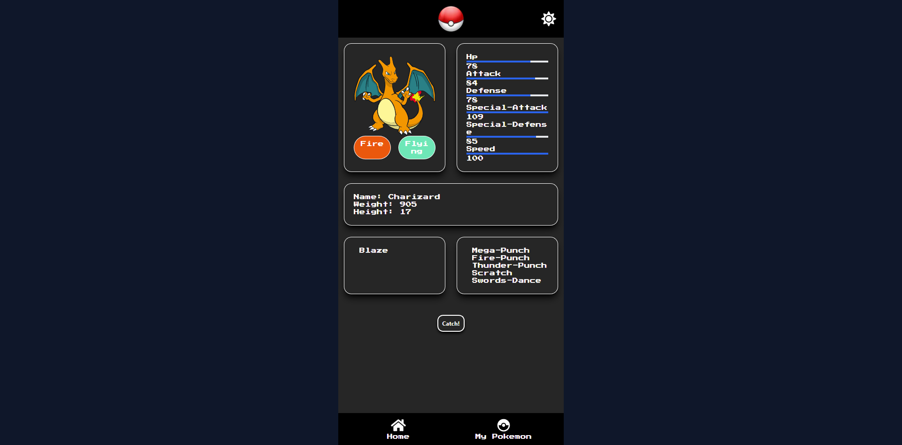

# Pokemon App

Pokemon app is a simple web app to get pokemons and battle them. This app is built using **Next.js** and **TailwindCSS**, deployed on **Vercel**. This app is also a PWA, so you can install it on your device. Using this app, you can get pokemons, get pokemon details, battle pokemons, and catch pokemons. Also this app is using the famous PokeAPI to get pokemons data.

## Documentation

[Deployment](https://pokemon.devanada.com/)

## Features

- Get pokemons using PokeAPI
- Get pokemon details
- Immersive battle page just like the original game
- Catch pokemons and add them to your pokedex (local storage)
- Pokedex page to view your caught pokemons
- Pagination for pokemons list
- PWAs support
- Dark mode

## Tech Stack

**Client:** Next.js, Axios, TailwindCSS, React-Icons, Next-PWA

## Run Locally

Clone the project

```bash
  git clone https://github.com/devanada/pokemon-app.git
```

Go to the project directory

```bash
  cd pokemon-app
```

Install dependencies

```bash
  npm install
```

Start the server

```bash
  npm run dev
```

## Screenshots





